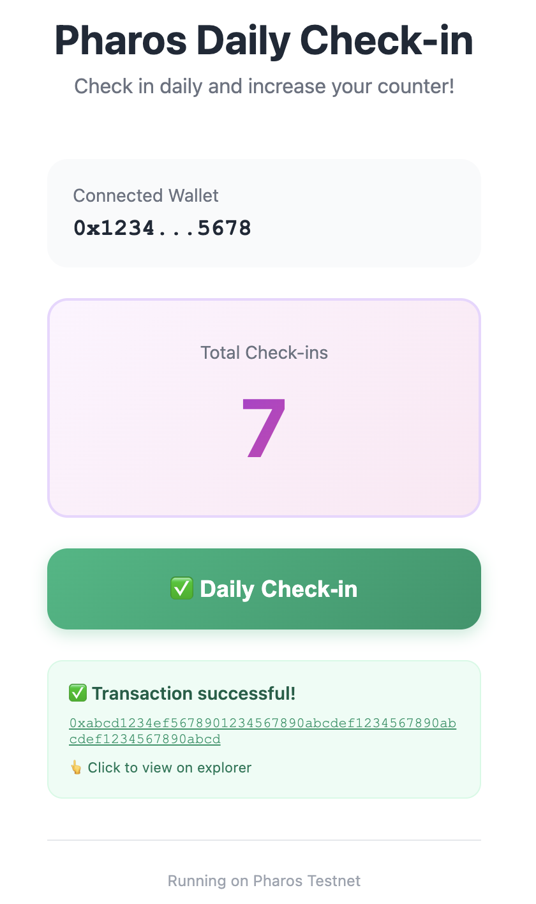

[](https://vercel.com/new/clone?repository-url=https://github.com/YOUR_USERNAME/pharos-checkin-app)

# 🚀 Pharos Daily Check-in

A decentralized daily check-in application built on **Pharos Testnet**. Connect your wallet, check in every day, and track your progress on-chain!



## ✨ Features

- 🔗 **MetaMask Integration** - Seamless wallet connection
- 🌐 **Pharos Testnet** - Built on Pharos blockchain
- 📊 **On-chain Tracking** - All check-ins stored on blockchain
- 🎨 **Modern UI** - Beautiful responsive design with Tailwind CSS
- 🌙 **Dark Mode** - Full dark mode support
- 🔍 **Transaction Explorer** - View all transactions on Pharosscan
- ⚡ **Real-time Updates** - Instant counter updates

## 🌐 Live Demo

**[View Live App →](https://pharos-checkin-app-zuln.vercel.app/)**

**Contract Address:** [`0x94bc90f31bf2422e0cabf0ab95f18a79b1770e11`](https://testnet.pharosscan.xyz/address/0x94bc90f31bf2422e0cabf0ab95f18a79b1770e11)

## 🚀 Quick Start

### Prerequisites

- Node.js 18 or higher
- MetaMask browser extension
- Pharos Testnet tokens ([https://testnet.pharosnetwork.xyz/](#))

### Installation

```bash
# Clone the repository
git clone https://github.com/YOUR_USERNAME/pharos-checkin-app.git

# Navigate to directory
cd pharos-checkin-app

# Install dependencies
npm install

# Create .env.local file
cp .env.example .env.local

# Start development server
npm run dev
```

Open [http://localhost:3000](http://localhost:3000) in your browser.

## 🔧 Environment Variables

Create a `.env.local` file in the root directory:

```env
NEXT_PUBLIC_PHAROS_RPC_URL=https://testnet.dplabs-internal.com
NEXT_PUBLIC_CHAIN_ID=688688
NEXT_PUBLIC_CONTRACT_ADDRESS=0x94bc90f31bf2422e0cabf0ab95f18a79b1770e11
```

## 📖 How It Works

1. **Connect Wallet** - Click the connect button to link your MetaMask
2. **Switch Network** - Automatically adds/switches to Pharos Testnet
3. **Check-in** - Click the check-in button to record on blockchain
4. **Track Progress** - View your total check-ins instantly

## 🏗️ Tech Stack

- **Frontend:** Next.js 14, React 18, TypeScript
- **Styling:** Tailwind CSS
- **Blockchain:** Ethers.js v6
- **Smart Contract:** Solidity 0.8.20
- **Deployment:** Vercel

## 📝 Smart Contract

The DailyCheckIn smart contract:
- ✅ Tracks check-in count per address
- ✅ Records last check-in timestamp
- ✅ Emits CheckedIn events
- ✅ Gas-optimized
- ✅ Open source and verified

**[View Contract on Pharosscan →](https://testnet.pharosscan.xyz/address/0x94bc90f31bf2422e0cabf0ab95f18a79b1770e11)**

## 🌐 Pharos Testnet Info

| Property | Value |
|----------|-------|
| Network Name | Pharos Testnet |
| RPC URL | https://testnet.dplabs-internal.com |
| Chain ID | 688688 |
| Symbol | PHAR |
| Explorer | https://testnet.pharosscan.xyz |

## 🚀 Deploy Your Own

### Deploy to Vercel

[](https://vercel.com/new/clone?repository-url=https://github.com/YOUR_USERNAME/pharos-checkin-app)

1. Click the button above
2. Connect your GitHub account
3. Add environment variables:
   - `NEXT_PUBLIC_PHAROS_RPC_URL`
   - `NEXT_PUBLIC_CHAIN_ID`
   - `NEXT_PUBLIC_CONTRACT_ADDRESS`
4. Deploy!

**[Detailed Deployment Guide →](./DEPLOYMENT.md)**

## 📁 Project Structure

```
pharos-checkin-app/
├── app/                    # Next.js app directory
│   ├── page.tsx           # Main check-in page
│   ├── layout.tsx         # Root layout
│   └── globals.css        # Global styles
├── contracts/             # Smart contracts
│   └── DailyCheckIn.sol  # Main contract
├── types/                 # TypeScript types
└── public/                # Static assets
```

## 🤝 Contributing

Contributions are welcome! Please feel free to submit a Pull Request.

1. Fork the project
2. Create your feature branch (`git checkout -b feature/AmazingFeature`)
3. Commit your changes (`git commit -m 'Add some AmazingFeature'`)
4. Push to the branch (`git push origin feature/AmazingFeature`)
5. Open a Pull Request

## 📄 License

This project is licensed under the MIT License - see the [LICENSE](LICENSE) file for details.

## ⚠️ Disclaimer

This is a testnet application for educational purposes. Always verify transactions and use at your own risk.

## 🔗 Links

- **Live App:** [Your Vercel URL]
- **Contract Explorer:** [View on Pharosscan](https://testnet.pharosscan.xyz/address/0x94bc90f31bf2422e0cabf0ab95f18a79b1770e11)
- **Documentation:** [DEPLOYMENT.md](./DEPLOYMENT.md)

## 🌟 Show Your Support

Give a ⭐️ if this project helped you!

---

**Built with ❤️ for the Pharos Community**
